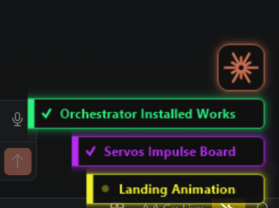

# Claude Session HUD

**An ambient heads-up display for running many Claude Code sessions at once.**


When you've got several Claude Code chats going in parallel, you lose track of which one
is which, which is still working, and — the big one — **which one is blocked waiting for
you**. This is a lightweight, hook-based HUD that answers that at a glance, layered over
the sessions you already run. No new app, no orchestrator, no worktree management: it just
watches Claude Code's hooks and draws a small always-on-top UI.

<p align="center">
  
</p>

> A real Claude Code **plugin**, distributed from this repo's marketplace. The **badges,
> window tint, and button are Windows-only** (WPF/Win32); the **desktop notification** that
> tells you a session needs you works on **macOS, Linux, and Windows**.

## What you get

| Feature | What it does |
|---|---|
| **Per-chat badge** | A small persistent chip, bottom-right, one per chat — in that chat's own color. It stays put while the chat's window is open (it won't vanish from disuse), and the tab for the window you're currently in stays lit. |
| **Live state** | The badge shows **✓ done**, a **breathing dot = working**, or a **blinking ring = awaiting your input** (permission / idle). This is the "which session needs me?" signal. |
| **Smart name** | The badge is labelled with a 1–3 word summary of what the chat has been working on (from the transcript, via an LLM), not just the folder name. |
| **Click to jump** | Left-click a badge to focus that chat's VS Code window; right-click to hide it — it comes back when you refocus that window or send the chat a new prompt. Hover a badge (or the button) for a hint on what the clicks do. |
| **Window color-coding** | The focused chat's VS Code window gets a matching color accent along its top edge. |
| **New-window button** | An always-on-top spark button; click it to open a **new chat in a new window** (so each chat is its own window and the click-to-jump lands precisely). |
| **"Needs you" popup** | When a background session goes **awaiting your input**, an always-on-top card (colored to match that session) slides in top-right — click it to jump to the chat, hover to keep it up. It's one we draw ourselves, so Windows notification settings / Focus Assist can't suppress it. Off-Windows it falls back to a native desktop toast. |

Badges stack, so several chats form a tidy dock; the button rides on top of the stack.

## How it works

Everything is driven by Claude Code **hooks** → one dispatcher (`scripts/hal_badge.py`):

- `SessionStart` / `UserPromptSubmit` → mark the chat, capture its window, refresh its name
- `PreToolUse` / `PostToolUse` → keep the badge and helpers alive while it works
- `Notification` → mark the chat **awaiting input**
- `Stop` → mark the chat **done**

The dispatcher writes tiny per-chat state files under `~/.claude/hal_voice/`. Three small
always-on-top helpers render from that state and clean themselves up:
`badge.ps1` (the badges), `hal_tint.ps1` (the window accent), `claude_button.ps1` (the
button). Shared Win32/layered-window helpers live in `scripts/popup_common.ps1`.

On the transition into *awaiting input* the dispatcher raises a notification: on Windows an
always-on-top card we draw ourselves (`scripts/popup.ps1`, colored to the session, click to
jump), which can't be suppressed by Focus Assist. Where that's unavailable it falls back to
`scripts/hal_notify.py` — a native toast via `osascript` (macOS), `notify-send`/`zenity`
(Linux), or WinRT (Windows) — best-effort and guarded, so *some* nudge lands on every OS.

Tab names come from **Claude**. With no setup it uses **your existing Claude Code login** —
the plugin finds the `claude` CLI on your PATH or the copy bundled in the VS Code / Cursor
extension and asks `claude-haiku` for a 1–3 word name (no API key, runs on your subscription).
Set `ANTHROPIC_API_KEY` (or drop a key in `~/.claude/.anthropic_key`) to use the API instead —
faster. If Claude isn't reachable it degrades to a local keyword theme. OpenAI is opt-in only
(`use_openai` + `OPENAI_API_KEY`).

## Install

```powershell
git clone https://github.com/Tchurkin/Claude-Code-Session-HUD
cd Claude-Code-Session-HUD
/plugin marketplace add C:\path\to\Claude-Code-Session-HUD
/plugin install claude-session-hud@session-hud
```
(For dev iteration: `claude --plugin-dir C:\path\to\Claude-Code-Session-HUD\plugins\hal-voice`.)

Needs a `python` on PATH for the hooks (no third-party packages). Reload Claude Code so the
hooks load. Tab names work out of the box via your Claude Code login — no API key needed.

## Updating

Plugins don't auto-update from a plain push — Claude Code delivers a new version only when
the plugin's `version` is bumped, and third-party marketplaces have auto-update **off** by
default. So to get the latest:

```powershell
/plugin marketplace update session-hud   # pull the newest version
/reload-plugins                          # apply it in the current session
```

Prefer hands-off? Open `/plugin` → **Marketplaces** → select this one → **Enable auto-update**;
Claude Code will then refresh it at startup and prompt you to reload when there's a new version.

## Config (`~/.claude/hal_voice/config.json`)

| key | meaning |
|---|---|
| `badge` | show the per-chat badges (default true) — *Windows* |
| `window_tint` | color-accent the focused chat window (default true) — *Windows + VS Code* |
| `button` | show the new-window button (default true) — *Windows* |
| `popup` | our own on-screen "a session needs you" card, colored to the session (default true) — *Windows* |
| `notify` | native desktop toast; fallback when `popup` is off or off-Windows (default true) — *cross-platform* |
| `use_openai` | name tabs with OpenAI instead of Claude (default false; needs `OPENAI_API_KEY`) |

## Limitations & roadmap

- **The badges/tint/button are Windows-only**; the **notification layer is cross-platform**
  (macOS/Linux/Windows). Native badges for macOS/Linux is the biggest thing that would broaden it.
- **Click-to-jump / window accent are VS Code + Windows specific** (they use window
  handles). The core state HUD (which chat is working / done / waiting) is universal and
  is the part worth generalizing first.
- The **"awaiting input"** signal is the highest-value piece — it maps to open Claude Code
  feature requests for knowing which parallel session is blocked.

PRs / issues welcome — especially cross-platform rendering and better "waiting for input"
detection.

## Notes

- The plugin folder is still named `hal-voice` (this started life as a HAL-9000 voice
  notifier); the voice half has been removed. It's an internal name only — renaming it is a
  cosmetic follow-up (update the hook paths in `~/.claude/settings.json` if you do).
- MIT licensed.
