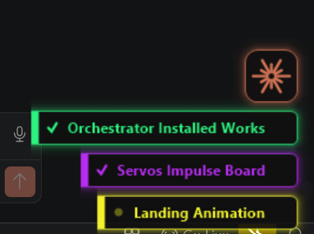

# Claude Session HUD

**An ambient heads-up display for running many Claude Code sessions at once.**


When you've got several Claude Code chats going in parallel, you lose track of which one
is which, which is still working, and — the big one — **which one is blocked waiting for
you**. This is a lightweight, hook-based HUD that answers that at a glance, layered over
the sessions you already run. No new app, no orchestrator, no worktree management: it just
watches Claude Code's hooks and draws a small always-on-top UI.

<p align="center">
  
</p>

> A real Claude Code **plugin**, distributed from this repo's marketplace. The **badges,
> window tint, and button are Windows-only** (WPF/Win32); the **desktop notification** that
> tells you a session needs you works on **macOS, Linux, and Windows**.

## What you get

| Feature | What it does |
|---|---|
| **Per-chat badge** | A small persistent chip, bottom-right, one per chat — in that chat's **own stable color** (remembered durably, so the same chat keeps its color across despawn/respawn; it only changes to break a clash with another live chat). The tab for the window you're currently in stays lit. Sits just above VS Code's status bar so it doesn't cover the bottom-bar buttons. |
| **A tab for every open chat** | The tab strip tracks **the chats you actually have open**, not just the ones that happened to fire a hook. Every few seconds the HUD reconciles itself against Claude Code's own registry of live sessions: a chat with no tab gets one (even if it's been sitting idle since you opened it, and even if it's the **second chat in the same window**), a tab whose window was killed comes back, and a tab whose chat has closed goes away. Tabs are never retired for being quiet — only for being **gone**. |
| **Live state** | The badge shows **✓ done**, a **breathing dot = working**, a **pulsing ? = asking you a question**, or a **blinking ring = awaiting your input** (permission / idle). This is the "which session needs me?" signal — and a question is called out separately from a permission prompt, because only one of them is waiting on your judgement. |
| **Audible nudge** | A chat that needs you also **chimes**: a short rising two-tone when it's asking you something or blocked on a permission, a single softer note when a background chat has finished and wants a reply, and the same rising two-tone once when your session burn tips into red (see [burn rate](#burn-rate-what-the-colour-means)). It's a `winsound` beep from the hook, so it costs no process and Focus Assist can't swallow it. `sound: false` in the config turns it off. |
| **Branch, when it matters** | A chat's git branch is appended to its tab **only when it tells that chat apart from another one you have open** — one chat per worktree, each on its own branch, which is what the branch is there for. Several chats in the same folder on the same branch don't all get the same suffix; that's clutter, not information. `main`/`master` are never shown. |
| **Smart name** | Each badge is labelled with the chat's **area of work** in 1–3 words (via Claude) — *College Apps*, *PCB Layout*, *Firmware Engineering* — not the task of the moment, so a tab you learn to recognize stays recognizable. Chats sharing a project folder are told each other's names and get **distinct** ones. It re-checks on every prompt but only renames when the chat has moved to a genuinely different kind of work; if Claude can't be reached it falls back to the project folder, tidied (`claude-code-hud-main` → *Claude Code HUD*). |
| **Jump to the right chat** | Clicking a badge doesn't just raise a window — it **switches that window to the chat's tab and puts the cursor in its input**. A window holds several chats and only one is in front, so raising it alone lands you in the wrong conversation. A tab also knows *which* window its chat is in: the [companion extension](vscode-extension/) reports what each window is holding, and failing that the chat's own title is matched against what each window is displaying. So chats sharing a folder don't all jump to the same place, and one in a multi-root **Untitled (Workspace)** window (whose title never names the folder) still resolves. Only the chat a window is *currently* showing lights up as "the tab you're on". |
| **Jump / stow (drawer)** | Left-click a badge to jump to that chat's VS Code window. **Right-click stows it** — the tab slides into a drawer at the right edge, leaving just its colored edge showing; it's never destroyed. **Click the stowed edge (either button) to slide it back out.** **Drag a tab up or down to reorder the stack** — the others slide out of the way while you're still holding it, so you can see where it will land before you commit, and the order sticks. The drawer state and order are remembered across restarts. Hover a badge (or the button) for a hint on what the clicks do. |
| **Window color-coding** | The focused chat's VS Code window gets a matching color accent along its top edge — in the colour of the chat that window is **currently showing**, so a window holding several chats re-tints as you switch between them rather than being stuck on whichever one sorted first. |
| **Readable colors** | Each chat's accent is its tab's *text*, on a near-black chip, so hue alone can't be the whole story: at full saturation a blue sits at ~2:1 contrast against that chip while a yellow is ~13:1. Colors are stepped toward white until they clear WCAG AA (4.5:1), so dark hues arrive as pastels and already-bright ones are left untouched — distinct *and* legible. |
| **Session usage meter** | A meter above the tab stack showing **how much of your 5-hour session window you have spent** — the real figure from your plan, the same number the usage page in the browser shows, not a local estimate. The session bar is the headline, with **the percentage and how long is left in the window** beside it (`8% - 4h 41m`), because that is the limit you actually hit during a day's work; a **thinner, dimmer bar underneath tracks the weekly window**, which is rarely the binding constraint but worth seeing creep up. The session bar is coloured by **where the window is heading rather than how full it is** — how full it is is what the bar's length already says. See [burn rate](#burn-rate-what-the-colour-means). The weekly bar keeps the plain thresholds: green, amber past 60%, red past 85%. Both go **grey when the reading has gone stale**. **Either mouse button** opens the detail panel; there's no hover tooltip, because the panel says all of it and saying it twice was clutter. The countdown ticks down each minute, and disappears when the reading is stale, because a countdown from an old reading is a guess. **Click the bars** for a detail panel: the burn rate, tokens a minute, where the window lands, the weekly window, and the last twenty minutes at a size you can read. Click again, or anywhere else, to dismiss. |
| **Slide it out of the way** | A **chevron at the right edge** slides the whole dock off the screen and back, flipping itself as it goes. Different from the on/off toggle below: that retires every overlay, this just parks them, so a chat that needs you still has a tab waiting when you pull it back. The dock is a tab per chat plus the meter — separate windows, separate processes — so they don't each animate themselves; they all evaluate **one curve against one shared clock**, which is what makes it read as a panel closing rather than as tabs scattering. The state survives a restart. `dock_button: false` removes it. |
| **On/off toggle** | Turn the whole HUD off and back on from a **VS Code status-bar button** — a companion extension in [`vscode-extension/`](vscode-extension/) (green = on, dim = off). When off, the badges/tint/button/cards all disappear; flip it back on and they return. (Under the hood it's a `enabled` flag in the config, so you can also toggle it by hand or from your own script.) |
| **"Working on" cards** | A top-right card per chat, colored to that chat, showing its name and **a short summary of what it's doing** (e.g. *"fixing sim landing crash"*, *"adding servos to schematic"*) — it stays up while the chat works and turns to a brief **done** when it finishes. Hover for a hint; clicking it jumps to that chat exactly as its tab does — the right window **and** the right tab inside it. |
| **"Needs you" popup** | When a background session goes **awaiting your input**, an always-on-top card (colored to match that session) slides in top-right — **left-click to jump** straight into that chat (its window, and its tab within it), **right-click to dismiss**. It's one we draw ourselves, so Windows notification settings / Focus Assist can't suppress it. Off-Windows it falls back to a native desktop toast. |
| **Cards fade, and wait for you** | A card holds — 12s for "what it's doing", 40s for one that needs you — then **fades out slowly over ten seconds** rather than blinking away. **Hovering brings it straight back to full strength and restarts the clock**, even if it was nearly gone. A new card **glides down into place while the ones below slide out of its way** (it claims its slot before it draws, so they're already moving by the time it appears). And there is only ever **one card per chat**: a new one replaces that chat's previous card, whichever kind it is. |
| **Waiting-for-you alert** | When a background chat **finishes and is waiting on your reply**, a persistent top-right card tells you — so a chat that's done in another window doesn't sit there unnoticed. Click to jump; it clears once you reply. (The chat you're actively looking at just gets a quiet "done".) |

Badges stack, so several chats form a tidy dock, with the usage meter riding on top of them. The
stack stops at the top of the screen: past what fits, the tabs furthest from the dock are **parked**
— they keep their place in the order and come straight back when there's room, and the meter shows
`+N` so they're never silently gone. Left alone this only ever happens around twenty chats, where
the alternative was tabs walking off-screen where they couldn't be clicked; `max_tabs` sets a lower
cap if you'd rather a shorter dock.

## How it works

What each tab *says* is driven by Claude Code **hooks** → one dispatcher (`scripts/hal_badge.py`):

- `SessionStart` / `UserPromptSubmit` → mark the chat, capture its window, refresh its name
- `PreToolUse` (only `AskUserQuestion` / `ExitPlanMode`) → mark the chat **asking you a question**
- `Notification` → mark the chat **awaiting input**
- `Stop` → mark the chat **done**
- `SessionEnd` → the chat is closing; drop its tab

Which tabs *exist* is not left to hooks, because a hook only fires when a chat does something —
a chat you opened and haven't prompted yet, or one that's been idle for an hour, announces
nothing. Instead `scripts/hal_sessions.py` reconciles the HUD against Claude Code's own registry
of live sessions (`~/.claude/sessions/<pid>.json`, filtered to PIDs that are genuinely still
running, newest process per chat). Anything open with no tab is adopted — named instantly from a
keyword read of its transcript, then upgraded to a Claude-written name in the background — and
anything closed is retired. It runs as one small daemon per machine (a few polls a minute, exits
once nothing is open) *and* inline on every hook, so a missing tab heals within seconds even if
the daemon isn't up. On an older CLI with no session registry, the badge falls back to its
previous hook-only lifecycle.

That daemon is the root of everything on screen, so **everything on screen watches it back**: each
tab badge, the window tint and the usage meter all revive it if its heartbeat goes quiet. Badges
matter most — there's one per open chat, so the number of watchers scales with what there is to
lose, and only the daemon can retire a badge, so they outlive it. A cross-process mutex means N
watchers noticing at once still produce exactly one daemon, and a daemon that's stopped responding
without exiting gets reaped first — it would otherwise still hold the singleton lock and make every
replacement exit on startup, forever.

Which **window** a tab points at is worked out by evidence rather than guesswork, best source first.
The companion extension runs inside each window and writes what it's holding — every chat tab, and
which is in front — to `~/.claude/hal_voice/windows/`; that places even a chat sitting in a
background tab. Without it, VS Code puts the active tab's name at the front of the window title, so
a window announces the chat it's showing and the reconciler matches that against the `aiTitle` in
each chat's transcript. Either beats a folder name (two chats in one repo, or a multi-root workspace
window that names no folder at all). A binding sticks once made, live evidence overrides a stale
one, and only where nothing can be told apart does it fall back to matching folder names.

Clicking a badge writes `focus.json`; the extension in whichever window owns that chat brings its
tab to the front and focuses the input, while the badge raises the window over Win32. A chat that
`cd`s deep into its own project keeps its identity — hooks report the session's *current* directory,
and a tab renaming itself after a subfolder is noise.

The dispatcher writes tiny per-chat state files under `~/.claude/hal_voice/`; a tab's state file
existing *is* the tab. Three small always-on-top helpers render from that state:
`badge.ps1` (the badges), `hal_tint.ps1` (the window accent), `hal_meter.ps1` (the usage
meter, which also keeps the reconciler alive). Shared Win32/layered-window helpers live in
`scripts/popup_common.ps1`.

Handy when something looks off: `python scripts/hal_sessions.py --list` prints every chat the HUD
believes is open and how many have tabs.

**Cost.** Hooks are the other half of the bill: each one is a process spawn (~300ms), and `PreToolUse` /
`PostToolUse` used to fire on *every* tool call just to keep the badge alive — a job the reconciler has done
on its own for a while. They're gone; the only per-tool hook left fires when a chat asks you something.

The overlays are PowerShell processes drawing layered windows, so the HUD is careful about
what it does per frame. Each one runs at full rate only while something is actually moving, pulsing
or under the cursor, and drops to a slow idle poll otherwise; state and config files are re-parsed
only when their timestamps change; the cross-process stacking registry is a line of text rather than
JSON; a tab that is merely animating blits a cached surface instead of rebuilding its glow; and hooks
skip a reconcile the daemon has just done. Idle, with six chats open, that is a few percent of one
core rather than two and a half cores.

On the transition into *awaiting input* the dispatcher raises a notification: on Windows an
always-on-top card we draw ourselves (`scripts/popup.ps1`, colored to the session, click to
jump), which can't be suppressed by Focus Assist. Where that's unavailable it falls back to
`scripts/hal_notify.py` — a native toast via `osascript` (macOS), `notify-send`/`zenity`
(Linux), or WinRT (Windows) — best-effort and guarded, so *some* nudge lands on every OS.

Tab names come from **Claude**. With no setup it uses **your existing Claude Code login** — the
plugin finds a `claude` binary (PATH, or the copy bundled in the VS Code / Cursor extension) and
asks `claude-haiku` to name the chat's *area of work* in 1–3 words, given the project folder and
what its neighbouring chats are already called (no API key, runs on your subscription). Set
`ANTHROPIC_API_KEY` (or drop a key in `~/.claude/.anthropic_key`) to use the API instead — faster.
If Claude can't be reached the tab falls back to its project folder, tidied, which is already about
the right label; a newly adopted tab wears that folder name immediately and is renamed in the
background so nothing waits on the network. OpenAI is opt-in only (`use_openai` + `OPENAI_API_KEY`).

*Windows note:* an npm install puts a `#!/bin/sh` shim named `claude` on PATH next to `claude.cmd`.
Windows can't execute it, so the plugin asks for real executables by name — a naming call that dies
on the shim (or on a Greek letter hitting an ANSI pipe) is why tabs used to end up with scraped
keyword names like *"Will Measure ALL"*.

## Install

```powershell
git clone https://github.com/Tchurkin/Claude-Code-Session-HUD
cd Claude-Code-Session-HUD
/plugin marketplace add C:\path\to\Claude-Code-Session-HUD
/plugin install claude-session-hud@session-hud
```
(For dev iteration: `claude --plugin-dir C:\path\to\Claude-Code-Session-HUD\plugins\hal-voice`.)

Needs a `python` on PATH for the hooks (no third-party packages). Reload Claude Code so the
hooks load. Tab names work out of the box via your Claude Code login — no API key needed.

## Updating

Plugins don't auto-update from a plain push — Claude Code delivers a new version only when
the plugin's `version` is bumped, and third-party marketplaces have auto-update **off** by
default. So to get the latest:

```powershell
/plugin marketplace update session-hud   # pull the newest version
/reload-plugins                          # apply it in the current session
```

Prefer hands-off? Open `/plugin` → **Marketplaces** → select this one → **Enable auto-update**;
Claude Code will then refresh it at startup and prompt you to reload when there's a new version.

### How the usage meter gets its numbers

Claude Code stores an OAuth token on your machine and its own `/usage` command reads
`api.anthropic.com/api/oauth/usage`; `scripts/hal_usage.py` asks the same endpoint and caches the
answer for the overlays to draw. It asks as often as the number is actually moving: every 45 seconds
while a chat is mid-turn, every four minutes while chats are open but idle, and once a minute
whenever it can't tell or hasn't got a burn rate yet. That's fewer requests than a fixed cadence
over a day *and* better resolution during the hours that matter — which is worth caring about,
because the endpoint rate-limits. It reads the token fresh each time and never
refreshes, rewrites, or sends it anywhere else — when the token expires the fetch simply fails, the
meter greys out, and it recovers on its own once Claude Code renews it in the course of being used.
That endpoint is not a documented API and could change; if it does, the meter goes grey rather than
wrong. When a request fails the retry backs off — doubling from a minute up to ten — so an expired
token or a rate limit costs one request every so often instead of one every few seconds. Set
`usage_meter: false` to turn the whole thing off.

### Tokens a minute

The plan's percentage only moves in whole points, so between readings it tells you nothing — and the
burn rate fitted to it needs five minutes before it says anything at all. The transcripts have the
real numbers, per message, with timestamps, and they're already on disk, so the detail panel also
shows a **tokens-per-minute** figure tailed straight from them.

It is deliberately not a raw token count. Three corrections make the difference between a number and
a decoration:

- Assistant records **repeat their usage block once per content block** — on a live transcript here,
  1779 records for 840 actual calls. Counted once, keyed on the message id.
- **Sub-agent spend lives in a separate file tree**, and on a busy chat it is larger than the main
  transcript. Both are walked.
- No raw total tracks what the plan actually charges. A turn can emit 1,200 tokens while re-sending
  half a million cached ones — output alone calls that nothing. The figure is **cost-weighted**, in
  the shape of the price list: an output token counts five, a fresh input token one, a cache read a
  tenth. That version tracks the plan's own utilization closely; the raw ones are out by 5–14×.

The files are megabytes and grow all day, so they're **tailed, never re-read**: each one's read
offset is remembered, only new bytes are parsed, a record still being written is left for next time,
and a file that has shrunk is treated as a new file rather than a rewind. Steady-state cost is about
35ms every five seconds, in the daemon, off your editor's thread.

### The reading between readings

The endpoint answers in whole percentage points, every 45 seconds at best — so between answers the
number is frozen, and a burn rate fitted to it needs five minutes of samples before it says anything.
Tokens are measured here continuously, so the displayed reading is **the last real one plus what
you've spent since**, and every fetch snaps it back to the truth.

The conversion is fitted, never assumed: consecutive readings give (points moved, tokens spent)
pairs, averaged over the last eight. Pairs are only trusted across a gap of four points or more —
at half a point of rounding on each end, a one-point gap is 50% error — and never across a window
rollover, where utilization falls off a cliff. A pair wildly out of line with the others is refused,
so one bad reading can't drag the fit somewhere it takes hours to climb out of.

Until it has fitted one it uses a documented default. Being roughly wrong there costs almost
nothing: the extrapolation only ever spans one poll interval, so even a rate that's twice off
mis-states the reading by a fraction of a point before the next fetch corrects it.

### Which chat is spending it

The panel lists the chats burning the window, biggest first, each in its own tab colour with a bar
relative to the greediest. Sub-agent spend bills to the chat that started it — that spend lives in a
separate file tree and on a busy chat it's the larger half, so leaving it out would undercount the
chats doing the most. It's the one thing the HUD always knew separately about tabs and about usage
and never put next to each other.

### When it can't reach the endpoint

The token Claude Code stores expires, and it's renewed by *using* Claude — so a machine left overnight
wakes with a stale one. The meter greys rather than showing an old number as though it were current,
and recovers on its own. Two things make that less annoying than it sounds:

- An expired token backs off far less than a rate limit does (a minute, against ten). They fail the
  same way and want opposite treatment: a 429 is asking to be left alone, whereas an expired token is
  fixed the instant you use Claude again.
- **If the window it measured has since ended, the old number isn't stale, it's wrong** — and that's
  knowable without asking anyone. So when the reset time has passed and nothing is running, both bars
  read zero and say "worked out" rather than greying. A real reading always replaces it.

### Burn rate: what the colour means

A percentage on its own is only half the story: 60% spent is comfortable four hours into a window and
alarming twenty minutes in. So the poller also keeps the last twenty minutes of readings and fits a
burn rate to them, which answers the question you actually have — **at this rate, do I run out before
the window resets?**

The colour is that answer:

| | |
|---|---|
| **Blue** | The burn does not get you there. Idle is blue, however much of the window has already gone. |
| **Green** | You are spending it exactly — at this rate you land on the limit just as the window rolls over. |
| **Amber → red** | You run out early, and the further along, the earlier. |

The scale is your burn rate against the rate you can still afford: the one that would spend exactly
what is left of the window over exactly the time left in it. Half that rate is a quarter of the way
along, the rate itself is green, and past it the scale becomes how *early* you run out — hitting the
limit just as the window closes is still green, hitting it immediately is full red. It is a
continuous ramp, not four steps; the colours below are the corners it turns.

The colour deliberately says nothing about how full the window already is, because that is what the
bar's length is for. Pricing it in twice would blunt the colour, which could then no longer say
"nothing is being spent" about a window where nothing is being spent. It goes red quickly enough on
its own when you start again: at 90% used the affordable rate is tiny, so ordinary work is a large
multiple of it and the colour is past green within about five minutes.

Until there are enough readings to fit a rate to — four spread over five minutes — the bar falls back
to the plain thresholds rather than inventing a trend from two samples.

A colour only helps while you're looking at it, so crossing into red also **chimes once and raises
a card** — that crossing is the one moment when easing off still changes the outcome. Once is the
hard part: it fires on the way up and only on the way up, and the burn has to fall back to a
genuinely quieter rate (not just wobble back over the line) before it can fire again. A window
rolling over re-arms it silently, because a fresh budget isn't news. The card belongs to no chat, so
clicking it just dismisses — and it says so. `usage_alert: false` turns it off.

The panel shows a **sparkline** of the whole window — not the twenty minutes the burn fit happens to need, which was never a display decision, so "on pace for 46%" comes
with the shape it was worked out from — a steady climb, a burst that's tailing off, or a flat line
that just ticked up. It spans the samples' own range rather than 0–100, because twenty quiet minutes
cover about two points and would otherwise be an invisible line along the bottom; but it never zooms
in past a two-and-a-half point window, so a single rounding tick stays a step instead of becoming a
cliff. An unchanging window draws flat through the middle. The chart appears and disappears with the
projection it sits beside — same four-sample threshold — so you never get a picture without the
sentence, or a sentence without the picture.

The reading only moves in whole percentage points, so the rate comes from a least-squares fit across
every sample rather than the difference between the first and last, which at these step sizes would
be mostly quantization. Samples age out of the twenty-minute window on their own, so putting the
laptop down brings the colour back down without anything having to notice you stopped.

## Config (`~/.claude/hal_voice/config.json`)

| key | meaning |
|---|---|
| `enabled` | master on/off for the whole HUD; flipped by the VS Code status-bar extension (default true) |
| `badge` | show the per-chat badges (default true) — *Windows* |
| `window_tint` | color-accent the focused chat window (default true) — *Windows + VS Code* |
| `popup` | our own on-screen "a session needs you" card, colored to the session (default true) — *Windows* |
| `status_card` | top-right per-chat card of what each chat is working on (default true) — *Windows* |
| `notify` | native desktop toast; fallback when `popup` is off or off-Windows (default true) — *cross-platform* |
| `sound` | short chime when a chat needs you: asking, blocked, or finished in the background (default true) |
| `usage_meter` | show how much of the 5-hour session window is used (default true) |
| `usage_alert` | chime and raise a card the moment your burn will run the session out early (default true) |
| `max_tabs` | cap the tab stack (default 0 — however many fit on screen) |
| `dock_button` | the chevron at the right edge that slides the dock away (default true) |
| `use_openai` | name tabs with OpenAI instead of Claude (default false; needs `OPENAI_API_KEY`) |

## Limitations & roadmap

- **The badges/tint/button are Windows-only**; the **notification layer is cross-platform**
  (macOS/Linux/Windows). Native badges for macOS/Linux is the biggest thing that would broaden it.
- **Click-to-jump / window accent are VS Code + Windows specific** (they use window
  handles). The core state HUD (which chat is working / done / waiting) is universal and
  is the part worth generalizing first.
- The **"awaiting input"** signal is the highest-value piece — it maps to open Claude Code
  feature requests for knowing which parallel session is blocked.

PRs / issues welcome — especially cross-platform rendering and better "waiting for input"
detection.

## Notes

- The plugin folder is still named `hal-voice` (this started life as a HAL-9000 voice
  notifier); the voice half has been removed. It's an internal name only — renaming it is a
  cosmetic follow-up (update the hook paths in `~/.claude/settings.json` if you do).
- MIT licensed.
